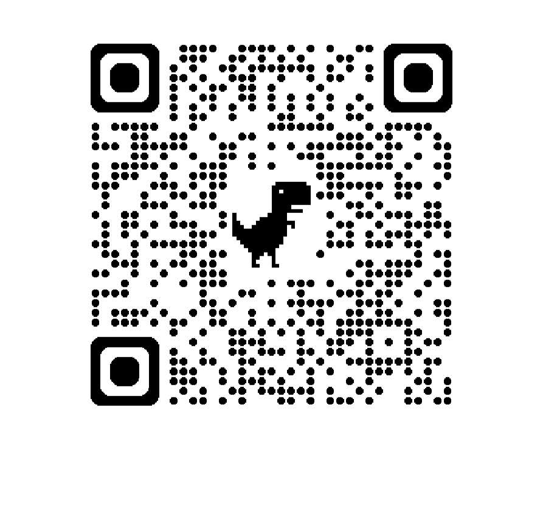

  

# 📋 מערכת ניהול QR דינמי - מחלקת גיוס

ברוכים הבאים למערכת ניהול הקישוריות של **ריבה יחזקאל בקרות**. מאגר זה מאפשר שליטה מלאה ודינמית על יעד הסריקה של קוד ה-QR המפורסם במודעות הדרושים.

---

## 🤳 קוד ה-QR להדפסה וסריקה
זהו הקוד הקבוע שיש להפיץ. במידה ויעד המשרות משתנה, הקוד יישאר זהה - יש לעדכן רק את הקישור במערכת.

  

---

## 📊 נתוני מערכת עדכניים
| נתון | סטטוס / ערך |
| :--- | :--- |
| **מצב חיבור** | פעיל ותקין ✅ |
| **כתובת הפניה נוכחית** | [https://www.riba.co.il/career/](https://www.riba.co.il/career/) |
| **דף נחיתה פעיל (Live)** | [https://Almog787.github.io/Tor4u/](https://Almog787.github.io/Tor4u/) |
| **עדכון אחרון** | 19/02/2026 11:36 |
| **ניטור ומעקב** | Google Analytics 4 פעיל 📈 |

---

## 🛠 הוראות תפעול ללקוח
כדי לשנות את הכתובת אליה מגיע מי שסורק את הקוד, יש לבצע את הפעולות הבאות:
1. היכנסו לקובץ [config.txt](./config.txt) במאגר זה.
2. לחצו על אייקון העיפרון (**Edit**) בצד ימין.
3. החליפו את הכתובת הקיימת בכתובת החדשה (וודאו שהיא מתחילה ב-http).
4. לחצו על **Commit changes** בתחתית הדף.
> **הערה:** המערכת תתעדכן באופן אוטומטי תוך מספר שניות מרגע השמירה.

---

פותח על ידי צוות פיתוח - GitHub Senior Partner Partner Partner Partner Partner Partner Partner

